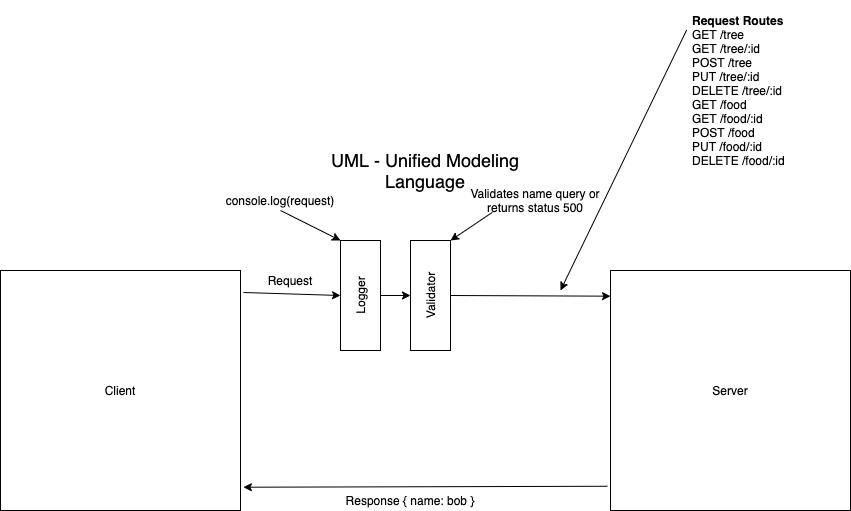

# LAB - Class 03

## Project: Basic APi Server

### Author: Simon Panek

#### Collaborators: Stacy Burris, Mariko Alvarado, Tina Meyers, Nathan Rhead-Cox, Nicco, Jeremy Penning

### Links and Resources

- [GitHub Actions](https://github.com/simon-panek/basic-api-server/actions) 

- [Heroku Deployment](https://simonpanek-basic-api-server.herokuapp.com/)

### Setup

#### `.env` requirements (where applicable)

- `PORT` - 3000

#### How to initialize/run your application (where applicable)

- `npm start`

- Routes
  - `GET /tree` returns an array of all of the tree objects in memory
  - `GET /tree/:id` returns `{ name: Cedar, id: 2 }`
  - `POST /tree` adds a new tree to memory
  - `PUT /tree/:id` updates a tree object
  - `DELETE /tree/:id` deletes a specified record
  - `GET /food` returns an array of all of the food objects in memory
  - `GET /food/:id` returns `{ name: Apple, id: 2 }`
  - `POST /food` adds a new food to memory
  - `PUT /food/:id` updates a food object
  - `DELETE /food/:id` deletes a specified record

#### Tests

- How do you run tests?
- Any tests of note?
- Describe any tests that you did not complete, skipped, etc

#### UML

